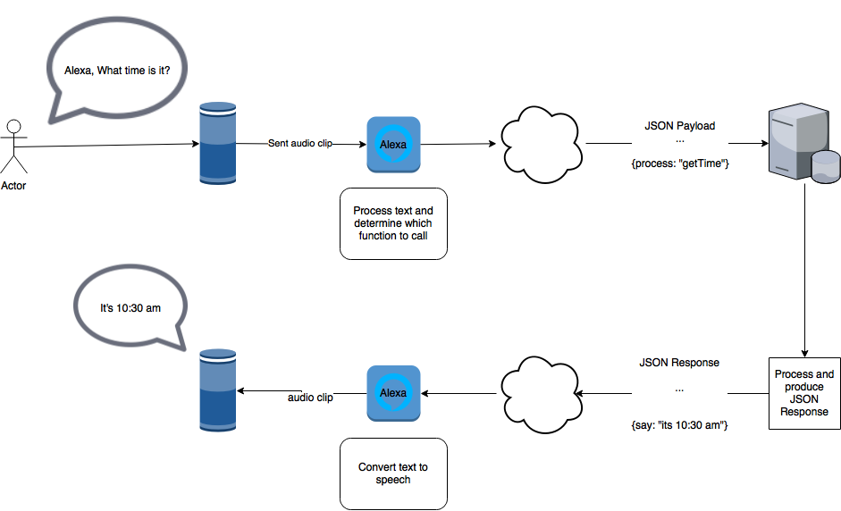

# Alexa

Help guide on Amazon Alexa for Hackathon 2018

<!-- TOC depthFrom:2 -->

- [About](#about)
  - [FAQ](#faq)
  - [How Alexa Works](#how-alexa-works)
- [Setup](#setup)
  - [Alexa Developer Account](#alexa-developer-account)
  - [AWS Developer console](#aws-developer-console)
  - [ASK CLI](#ask-cli)
  - [Links](#links)
- [Definitions](#definitions)

<!-- /TOC -->

## About

This guide will demonstrate how to get a `Hello World` example working with Alexa using multiple techniques. The focus of this guide is for Insum's internal Hackathon 2018 but can be used/leveraged for other purposes. This guide won't walk you through all the different options/possibilities of the Alexa API.

There are a lot of moving parts when working with Alexa and it can get confusing at times. Please always keep the following in perspective when developing for Alexa:

### FAQ

To help with the hackathon we'll be maintaining an [FAQ](faq.md) document

### How Alexa Works

This is a very simplified diagram of how Alexa works. A text description follows. If you ever get confused, always refer back to this diagram.

- User "asks" Echo something
  - This request is sent to Alexa (i.e. Amazon's servers)
- Alexa analyzes request
  - Alexa makes a REST request to a server of your choice
  - Your RESTful service processes request from Alexa then sends a response back to her
- Alexa sends text back to Echo device, and Echo says the response

## Setup
To register the Amazon Echo device, an Amazon account is required. Either use your existing Amazon account or create a new one (using your Insum email address).

Follow the [instructions](https://www.amazon.com/gp/help/customer/display.html?nodeId=202189140) to set up the device.  A phone or tablet will be required for this process.

> **NOTE** The language setting determines what skills are available to the device. Be sure to select a matching language when creating a skill.

### Alexa Developer Account

Go to [developer.amazon.com](https://developer.amazon.com/). Use your Amazon account to sign in.

### AWS Developer console

If you'd like to use [Lambda](https://aws.amazon.com/lambda/) you can either create and manage your own account and [IAM](https://aws.amazon.com/iam/) setup. More information can be found in the [`asl-cli-lambda.md'](asl-cli-lambda.md) document. 

An alternative is to use one already setup for you. Just ask Martin D to give you a `Access ID` and a `Secret Access Key`. 

_Note: If you using one provided by Martin, don't create a Bitcoin miner as it's coming off my credit card :-)_

### ASK CLI

If you'd like to use the Alexa Skill Kit (ASK) cli to manage and deploy your skills you can install everything yourself [here](https://developer.amazon.com/docs/smapi/quick-start-alexa-skills-kit-command-line-interface.html).

There is also a docker container with everything built in for you [here](https://github.com/martindsouza/docker-amazon-ask-cli)

### Links

Title | Description
--- | ---
[Alexa Developer Home](https://developer.amazon.com/alexa) |
[Skills Console](https://developer.amazon.com/alexa/console/ask) | Build, manage, test skills
[Understanding How Users Invoke Custom Skills](https://developer.amazon.com/docs/custom-skills/understanding-how-users-invoke-custom-skills.html) | How to properly ask Alexa questions
[Glitch](https://glitch.com/) | Create node.js apps online. No need to host your own server / manage https certificate. If you use this, sure to set the certificate type to Wildcard in the Endpoint definition.

## Definitions

It's important to understand Alexa's terminology. Below is a brief overview of some key terminology. For a more complete overview read this [article](https://medium.com/@screenmedia/utterances-slots-and-skills-the-new-vocabulary-needed-to-develop-for-voice-7428bff4ed79).

Term | Description | Example
--- | --- | ---
[Wake Word](https://www.amazon.com/gp/help/customer/display.html?nodeId=201971890) | What Alexa "listens to" before taking an action. In most cases it will be `Alexa` but can be configured to `Amazon` or `Echo`. | **Alexa** what time is it. In this example `Alexa` is the wake word.
Skill | "App" for Alexa | Complete list of Alexa skills [here](https://www.amazon.com/b?node=13727921011). Each one of them are skills.
[Invocation](https://developer.amazon.com/docs/custom-skills/choose-the-invocation-name-for-a-custom-skill.html) | Trigger word for skill | ["Alexa, ask CBC for help"](https://www.amazon.com/gp/product/B07743SCXC?ref=skillrw_dsk_pnps_dp_2) In this case the invocation is `CBC`. For custom skills invocations should be 2 or more words.
[Utterance](https://developer.amazon.com/docs/custom-skills/best-practices-for-sample-utterances-and-custom-slot-type-values.html) | What follows an invocation to determine intent | "Alexa, ask CBC for help". In this case `for help` would be the utterance. An intent can have multiple utterances.
[Intent](https://developer.amazon.com/docs/custom-skills/use-the-skill-builder-beta-to-define-intents-slots-and-dialogs.html#intents-and-slots) | What user is requesting / function to perform based on the utterance. | "Alexa what is the weather" - the intent is to find the weather. This is not a "text" thing, rather the function to call for a given Utterance.
[Slot](https://developer.amazon.com/docs/custom-skills/slot-type-reference.html) | Slots are like "parameters" to leverage. | `Alexa tell Oracle Demo my name is Martin` the slot would be `Martin`. Read the docs for more info.
