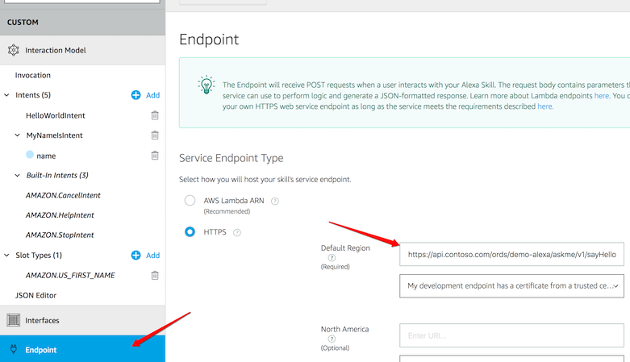

# Alexa FAQ

<!-- TOC depthFrom:2 depthTo:2 -->

- [How to set the endpoint?](#how-to-set-the-endpoint)
- [What SSL Certifcate Type should I use?](#what-ssl-certifcate-type-should-i-use)

<!-- /TOC -->

## How to set the endpoint?

They're two ways to set the endpoint:

1. Via the UI, click on `Endpoint` then change the `Default Region`:



2. Via the `ask cli`:

Modify `skills.json` and change the following:

```json
"apis": {
  "custom": {
    "endpoint": {
      "uri": "https://api.contoso.com/ords/demo-alexa/askme/v1/sayHello",
      "sslCertificateType": "Trusted"
    }
  }
},
...
```

Then re-deploy:

```bash
ask deploy -t skill
```


## What SSL Certifcate Type should I use?

In post cases the default `Trusted` option should work. If your domain provider has a wildcard certificate set to `Wildcard`. If you're using `skills.json` to manage endpoints use:

```json
"apis": {
  "custom": {
    "endpoint": {
      "uri": "https://demo.oracleapex.com/...",
      "sslCertificateType": "Wildcard"
    }
  }
},
...
```


